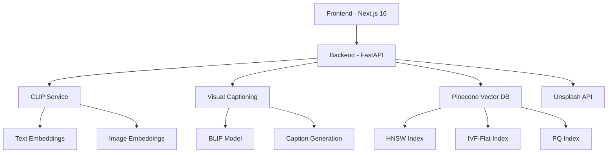

# 🔍 Advanced Semantic Image Search

A sophisticated, production-ready semantic image search application with AI-powered visual understanding, multi-modal search capabilities, and advanced scoring algorithms.

    

## 🌟 Features

### 🎯 **Advanced Search Modes**
- **Text Search**: Natural language queries with semantic understanding
- **Image Search**: Find similar images using visual similarity
- **Hybrid Search**: Combine text and image queries for precise results
- **Weighted Scoring**: Custom multi-modal fusion with adjustable weights

### 🧠 **AI-Powered Enhancements**
- **Visual Captioning**: Automatic image description using BLIP/LLaVA models
- **Smart Metadata**: AI-generated keywords and detailed descriptions
- **Semantic Understanding**: CLIP embeddings for deep visual-text alignment
- **Context-Aware Search**: Combines visual, textual, and metadata signals

### 🎛️ **Advanced Filtering**
- **Color Filters**: 11 color categories with RGB similarity matching
- **Orientation**: Landscape, Portrait, Square aspect ratio filtering
- **Date Range**: Temporal filtering with flexible date selection
- **Similarity Threshold**: Adjustable minimum score filtering

### 📊 **Intelligent Scoring**
- **Multi-Modal Fusion**: Weighted combination of similarity scores
  ```
  final_score = 0.6 × image_similarity + 0.2 × text_similarity + 0.2 × metadata_similarity
  ```
- **Component Transparency**: Detailed score breakdown for each result
- **Real-Time Adjustment**: Live weight tuning with visual feedback
- **Smart Normalization**: Automatic weight balancing

### 🚀 **Production Features**
- **Advanced Indexing**: HNSW (accuracy), IVF-Flat (speed), PQ (memory efficiency)
- **Favorites System**: Save and manage favorite images
- **Search History**: Automatic recent searches tracking
- **Download Support**: High-resolution image downloads
- **Dark/Light Theme**: Professional UI with theme persistence

### 🔧 **Fine-Tuning Ready**
- **LoRA Integration**: Low-Rank Adaptation for efficient model customization
- **Model Versioning**: Track and compare fine-tuned model performance
- **Custom Datasets**: Framework for domain-specific training
- **Evaluation Pipeline**: A/B testing for model improvements

## 🏗️ Architecture



### **Technology Stack**

**Frontend:**
- Next.js 16 with App Router
- TypeScript & Tailwind CSS v4
- Framer Motion animations
- Lucide React icons
- shadcn/ui components

**Backend:**
- FastAPI with async/await
- CLIP (OpenAI ViT-B/32)
- BLIP for visual captioning
- Pinecone vector database
- Pydantic for data validation

**AI/ML:**
- Hugging Face Transformers
- PyTorch for model inference
- NumPy for vector operations
- PIL for image processing

## 🚀 Quick Start

### Prerequisites
- Python 3.11+
- Node.js 18+
- Pinecone account
- Unsplash API credentials
- (Optional) GPU with CUDA

### 1. Clone Repository
```bash
git clone https://github.com/yourusername/semantic-image-search.git
cd semantic-image-search
```

### 2. Backend Setup
```bash
cd backend
python -m venv .venv
source .venv/bin/activate  # Windows: .venv\Scripts\activate

pip install -r requirements.txt
cp .env.example .env
# Edit .env with your API keys
```

### 3. Frontend Setup
```bash
cd ../frontend
npm install
# or yarn install
```

### 4. Environment Configuration

**Backend (.env):**
```env
UNSPLASH_ACCESS_KEY=your_unsplash_access_key
UNSPLASH_SECRET_KEY=your_unsplash_secret_key
PINECONE_API_KEY=your_pinecone_api_key
PINECONE_INDEX_NAME=semantic-image-search
PINECONE_NAMESPACE=default
```

### 5. Start Services
```bash
# Terminal 1 - Backend
cd backend
uvicorn app.main:app --reload

# Terminal 2 - Frontend
cd frontend
npm run dev
```

### 6. Access Application
- **Frontend**: http://localhost:3000
- **Backend API**: http://127.0.0.1:8000
- **API Docs**: http://127.0.0.1:8000/docs

## 📖 Usage Guide

### Basic Search
1. Enter a text query (e.g., "sunset over mountains")
2. Click search or press Enter
3. Browse results with similarity scores

### Advanced Search
1. Click the **Settings** icon in the search bar
2. **Search Modes**:
   - **Text**: Natural language queries
   - **Image**: Paste image URL for visual similarity
   - **Hybrid**: Combine text + image for precise results

### Weighted Scoring
1. Enable **Advanced Scoring** toggle
2. Adjust weight sliders:
   - **Image Similarity**: Visual feature matching
   - **Text/Metadata**: Semantic text understanding
   - **Color/Filters**: Attribute-based matching
3. See real-time score adjustments

### Filters
- **Color**: Select from 11 color categories
- **Orientation**: Landscape, Portrait, Square
- **Date Range**: From/To date selection
- **Min Score**: Similarity threshold (0-100%)

### Favorites & History
- **Add to Favorites**: Click heart icon in image modal
- **Recent Searches**: Automatically tracked
- **Download**: High-resolution image downloads

## 🔧 Advanced Configuration

### Indexing Strategies

**High Accuracy (HNSW):**
```python
config = IndexingStrategy.get_high_accuracy_config(dimension=512)
# Best for: <100K vectors, maximum precision
```

**High Speed (IVF-Flat):**
```python
config = IndexingStrategy.get_high_speed_config(dimension=512)
# Best for: 100K-1M vectors, fast retrieval
```

**Memory Efficient (PQ):**
```python
config = IndexingStrategy.get_memory_efficient_config(dimension=512)
# Best for: >1M vectors, compressed storage
```

### Visual Captioning Models

**BLIP (Production):**
```python
captioning_service = VisualCaptioningService(model_type="blip")
```

**Mock (Development):**
```python
captioning_service = VisualCaptioningService(model_type="mock")
```

### Fine-Tuning Integration

**LoRA Configuration:**
```python
fine_tuning_config = FineTuningConfig(
    enable_fine_tuning=True,
    use_lora=True,
    lora_rank=16,
    learning_rate=1e-4,
    custom_dataset_path="/path/to/domain/data"
)
```

## 📊 API Reference

### Search Endpoints

**POST /search**
```json
{
  "query": "mountain sunset",
  "mode": "hybrid",
  "image_url": "https://example.com/image.jpg",
  "use_advanced_scoring": true,
  "image_weight": 0.6,
  "text_weight": 0.2,
  "metadata_weight": 0.2,
  "color": "orange",
  "orientation": "landscape",
  "min_score": 0.3
}
```

**POST /upload-search**
```json
{
  "file": "image_file",
  "query": "similar landscapes",
  "top_k": 10
}
```

### Embedding Endpoints

**POST /embeddings/text**
```json
{
  "text": "A beautiful sunset over mountains"
}
```

**POST /embeddings/image-url**
```json
{
  "image_url": "https://images.unsplash.com/photo-123"
}
```

### Utility Endpoints

**GET /categories** - List Unsplash categories
**GET /stats** - Pinecone index statistics
**GET /health** - Service health check

## 🧪 Testing

### Backend Tests
```bash
cd backend
pytest
pytest --cov=app tests/  # With coverage
```

### Frontend Tests
```bash
cd frontend
npm test
npm run test:e2e  # End-to-end tests
```

## 🚀 Deployment

### Docker Deployment
```bash
# Build and run with Docker Compose
docker-compose up --build

# Or build individually
docker build -t semantic-search-backend ./backend
docker build -t semantic-search-frontend ./frontend
```

### Production Considerations

**Backend:**
- Use production ASGI server (Gunicorn + Uvicorn)
- Configure proper logging and monitoring
- Set up Redis for caching
- Use environment-specific configurations

**Frontend:**
- Build optimized production bundle
- Configure CDN for static assets
- Set up proper error boundaries
- Implement analytics tracking

**Database:**
- Use production Pinecone plan
- Configure proper index settings
- Set up backup strategies
- Monitor vector storage usage

## 🔮 Roadmap

### Near Term
- [ ] Real-time image upload processing
- [ ] Batch image ingestion pipeline
- [ ] Advanced analytics dashboard
- [ ] User authentication system

### Medium Term
- [ ] Multi-language support
- [ ] Video search capabilities
- [ ] Custom model fine-tuning UI
- [ ] Advanced visualization tools

### Long Term
- [ ] Federated search across multiple sources
- [ ] Real-time collaborative features
- [ ] Mobile application
- [ ] Enterprise SSO integration

## 🤝 Contributing

1. Fork the repository
2. Create feature branch (`git checkout -b feature/amazing-feature`)
3. Commit changes (`git commit -m 'Add amazing feature'`)
4. Push to branch (`git push origin feature/amazing-feature`)
5. Open Pull Request

### Development Guidelines
- Follow TypeScript/Python best practices
- Add tests for new features
- Update documentation
- Use conventional commit messages

## 📄 License

This project is licensed under the MIT License - see the [LICENSE](LICENSE) file for details.

## 🙏 Acknowledgments

- **OpenAI CLIP** for powerful vision-language understanding
- **Salesforce BLIP** for image captioning capabilities
- **Pinecone** for scalable vector search infrastructure
- **Unsplash** for high-quality image dataset
- **Hugging Face** for model hosting and transformers library

## 📞 Support

- **Documentation**: Check the `/docs` folder for detailed guides
- **Issues**: Report bugs via GitHub Issues
- **Discussions**: Join community discussions
- **Email**: support@semantic-search.com

---

**Built with ❤️ for the AI community**

*Semantic Image Search - Where AI meets Visual Discovery*
